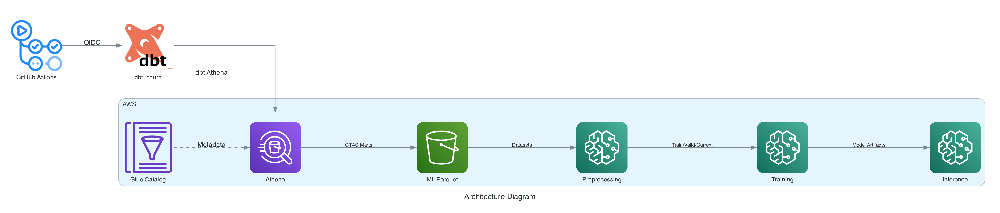

# Churn Prediction

Practice repo for a Fight Churn–style pipeline: event data in PostgreSQL, dbt models (Postgres locally, Amazon Athena in CI/CD), and SageMaker-style train / preprocess / inference containers. Companion Terraform for AWS (OIDC role, ECR, Athena paths, and so on) lives in the **`aws-terraform-infra`** repo — apply that stack and trust this GitHub repository for OIDC before cloud workflows succeed.

**Architecture (Athena · dbt · SageMaker):**



---

## Prerequisites

- [Docker](https://docs.docker.com/get-docker/) (for Postgres and SageMaker Local Mode)
- [uv](https://docs.astral.sh/uv/) (Python 3.13; see `pyproject.toml`)

---

## Local development

### 1. Postgres in Docker

From the repo root:

```bash
make up
```

This builds and starts PostgreSQL via `local-db/docker-compose.yml` (default host port **5433** so another Postgres can use 5432). Optional: copy `local-db/.env.example` to `local-db/.env` and adjust.

Useful targets: `make down`, `make psql`, `make url`, `make reload-data`. To fully reload seed data after the volume already exists: `docker compose -f local-db/docker-compose.yml down -v`, then `make up` again.

### 2. `actions2load.csv` from Google Drive

The **`events.user_actions`** seed load expects **`actions2load.csv`** at the **repository root**. `local-db` mounts that root at `/workspace`, and init SQL **`COPY`** uses `/workspace/actions2load.csv`. The file is **gitignored**.

```bash
uv sync --frozen --group dev    # installs gdown
uv run python scripts/download_actions2load.py   # writes ./actions2load.csv (default)
```

Uses the shared Drive id baked into `scripts/download_actions2load.py` (`--file-id` / `-o` override). Prefer a **fresh** Postgres volume so init runs **`COPY`** on first start (`make up` after the file exists), or **`make reload-data`** if the container is already populated.

### 3. dbt against local Postgres

```bash
cp dbt_churn/.env.example dbt_churn/.env   # tweak if you changed Postgres port or credentials
uv sync --frozen --group dev --group dbt
make -C dbt_churn dbt-deps
make -C dbt_churn dbt-build    # or: dbt-run / dbt-test
```

The default profile target is **`dev`** (Postgres). For Athena from your laptop, set `DBT_TARGET=ci` and the `ATHENA_*` variables described in `dbt_churn/.env.example` (and in the secrets section below).

### 4. CSV exports for ML notebooks

The preprocess notebook expects **`ml/outputs/churn_training_dataset.csv`** and **`ml/outputs/current_customer_dataset.csv`**. After a successful local dbt build, you can export the marts with the helper scripts (they write to `./outputs/` at the repo root by default):

```bash
mkdir -p ml/outputs outputs
uv run python scripts/export_churn_training_dataset.py
uv run python scripts/output.py
cp outputs/churn_training_dataset.csv outputs/current_customer_dataset.csv ml/outputs/
```

### 5. SageMaker Local Mode notebooks

These run the same Docker images CI pushes to ECR, but on your machine using [SageMaker Local Mode](https://docs.aws.amazon.com/sagemaker/latest/dg/use-with-sm.html):

- `ml/notebooks/sagemaker_local_preprocess.ipynb`
- `ml/notebooks/sagemaker_local_training.ipynb`
- `ml/notebooks/sagemaker_local_inference.ipynb`

**Setup**

1. **Separate env `./.venv-sm` for SageMaker Python SDK v2** (`sagemaker` is deliberately **not** in **`uv.lock`**). Use **`.venv-sm`** only for notebooks + **`sagemaker`**, and keep **`./.venv`** for **`uv sync --frozen`** (dbt / dev / diagrams) so installs stay predictable.

   ```bash
   cd churn-prac
   uv venv .venv-sm --python 3.13
   uv pip install --python .venv-sm/bin/python "sagemaker>=2,<3"
   ```

   Point Jupyter / Cursor / VS Code at **`./.venv-sm/bin/python`** and select that kernel (**`.venv-sm`** is the notebook display name in-repo).

2. **`uv sync --group ml`** installs `pandas`, `xgboost`, etc. into **`./.venv`** (what **`uv run`** uses—for CSV export helpers and editing **`churn_ml`** on the host). For notebooks that **only** drive Docker via Local Mode, you can skip **`ml`** inside **`.venv-sm`**. Add packages there only if notebook cells **`import`** them directly, e.g. **`uv pip install --python .venv-sm/bin/python pandas`**.

3. Build images from the **repository root** (tags must match the notebooks):

   ```bash
   docker build -f ml/containers/preprocess.Dockerfile -t churn-preprocess:local .
   docker build -f ml/containers/train.Dockerfile -t churn-train:local .
   docker build -f ml/containers/inference.Dockerfile -t churn-inference:local .
   ```

4. Open a notebook server from the repo root (or set **`PROJECT_ROOT`** in the first cells as documented in each notebook). Training expects processed files under **`ml/outputs/processed/`**; inference expects a trained model under **`ml/outputs/models/`** after you run preprocess + train flows.

---

## GitHub Actions (CI/CD)

| Workflow | When it runs | What it does |
|----------|----------------|---------------|
| **dbt CI** (`dbt-ci.yml`) | **Push** to `main` (any paths); **PR** when `dbt_churn/**`, `pyproject.toml`, `uv.lock`, or this workflow changes | Spins up Postgres in Actions, **`dbt parse`**, SQLFluff, Ruff (no Athena). |
| **dbt CD — Athena** (`dbt-cd.yml`) | Push to `main` or PR affecting `dbt_churn/**`, or manual dispatch | OIDC → AWS, **`dbt build`** against Athena (including CTAS exports when secrets are set). |
| **ML CD — ECR** (`ml-cd-ecr.yml`) | Push to `main` changing `ml/containers/**` or `ml/src/**`, or manual dispatch | Builds and pushes **churn-train**, **churn-preprocess**, **churn-infer** images to ECR. |
| **ML — SageMaker jobs** (`ml-sagemaker-dispatch.yml`) | Manual **workflow_dispatch** | Starts SageMaker Training / Processing jobs using those ECR images and S3 prefixes you provide. |

Terraform must expose OIDC trust for this repo (`churn_github_actions_repository_extra`) so **`AWS_ROLE_ARN`** succeeds. **`SAGEMAKER_EXECUTION_ROLE_ARN`** is required for the SageMaker dispatch workflow.

---

## Required GitHub Secrets (and optional variables)

Configure under **Settings → Secrets and variables → Actions** (secrets unless noted).

### ML (ECR + SageMaker): `ml-cd-ecr.yml`, `ml-sagemaker-dispatch.yml`

| Name | Purpose |
|------|--------|
| **`AWS_ROLE_ARN`** | IAM role ARN from Terraform output `github_actions_churn_role_arn` (OIDC). |
| **`SAGEMAKER_EXECUTION_ROLE_ARN`** | SageMaker execution role from Terraform `sagemaker_churn_execution_role_arn`. |

Optional **variables**: `AWS_REGION` (default `us-east-1`), `ML_INSTANCE_TYPE` (default `ml.m5.large`).

### dbt on Athena: `dbt-cd.yml`

Same **`AWS_ROLE_ARN`**; the role needs Athena, Glue, and S3 access for your configured prefixes.

| Name | Purpose |
|------|--------|
| **`ATHENA_DATABASE`** | Typically `awsdatacatalog`. |
| **`ATHENA_SCHEMA`** | Glue / dbt build schema (e.g. `dbt_churn_ci`). |
| **`ATHENA_S3_STAGING_DIR`** | Athena query results URI `s3://.../` (e.g. Terraform `churn_prac_athena_staging_s3_uri`). |
| **`ATHENA_S3_DATA_DIR`** | dbt warehouse / CTAS base `s3://.../` (e.g. `churn_prac_dbt_athena_s3_data_uri`). |
| **`ATHENA_WORK_GROUP`** | e.g. `churn_prac`. |
| **`ATHENA_ML_EXPORT_CHURN_TRAINING_PREFIX`** | `s3://.../` prefix for **`churn_training_dataset`** Parquet CTAS (must exist). |
| **`ATHENA_ML_EXPORT_CURRENT_CUSTOMER_PREFIX`** | `s3://.../` prefix for **`current_customer_dataset`** Parquet CTAS (must exist). |

If the two **`ATHENA_ML_EXPORT_*`** values are missing in the workflow environment, dbt falls back to placeholder buckets and Athena can return **`NoSuchBucket`**.

### SageMaker layout (cloud)

- **Training** expects `train.csv`, `valid.csv`, and `feature_columns.json` under the training channel prefix.
- **Preprocess** reads marts as `churn_training_dataset` and `current_customer_dataset` (CSV or layout compatible with `churn_ml.preprocess`).
- **Infer** expects `current.csv` at the current-features prefix and `xgboost_churn_model.joblib` plus `feature_columns.json` at the model prefix.

---

## Related paths

- `dbt_churn/` — dbt project and `make` shortcuts  
- `local-db/` — Postgres Docker image and load SQL  
- `scripts/` — helpers (CSV export, `download_actions2load.py`, **`diagram_athena_dbt_pipeline.py`** needs Graphviz `dot`; `uv sync --group dev`)  
- `ml/src/churn_ml/` — train, preprocess, inference entrypoints  
- `.github/workflows/` — CI/CD definitions  
